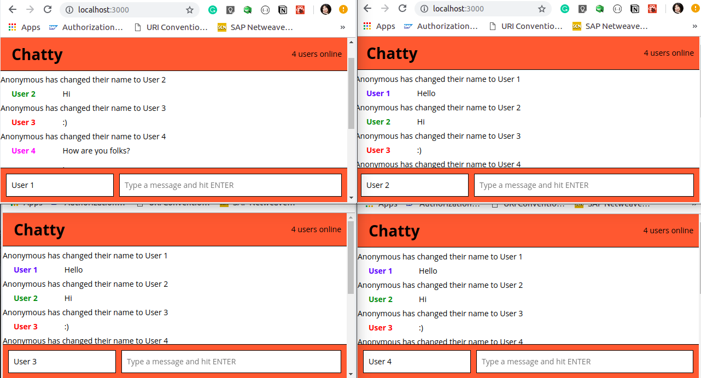
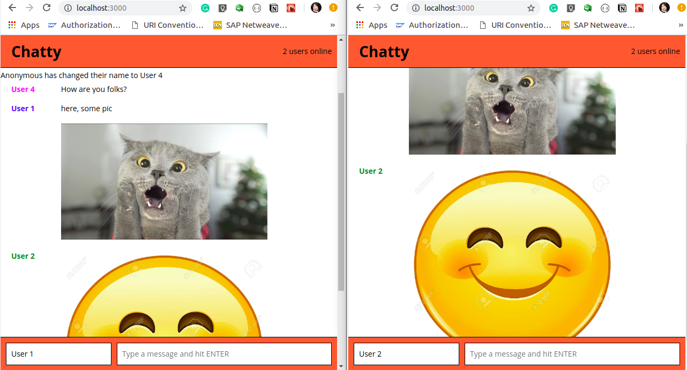

# Chatty Project

Chatty is a simple, single-page Chat page built using:

**Front-end:**
* HTML, CSS, React
**Back-end:**
* Node, Express and WebSockets

## Final Product






### Dependencies

#### Client
* React
* react-dom
* Webpack
* [babel-loader](https://github.com/babel/babel-loader)
* [webpack-dev-server](https://github.com/webpack/webpack-dev-server)

##### Development
* babel-core
* babel-loader
* babel-preset-es2015
* babel-preset-react
* babel-preset-stage-0
* css-loader
* eslint
* eslint-plugin-react
* node-sass
* sass-loader
* sockjs-client
* style-loader
* webpack
* webpack-dev-server

#### Server
* express
* uuid
* ws

### Getting Started

Install the dependencies and start the server.

```
npm install
npm start
```
Chatty WebSockets Server: http://localhost:3001

Install the dependencies and start the client.

```
npm install
npm start
```
Chatty React App: http://localhost:3000

## Features

* Change user's name when they press TAB.
* Connect to a real DB.
* Deploy

## Known issues

* You **must** change username Anonymous for another one before starting. And you **must** press ENTER every time you change the user's name.
* You can have only 4 people using the chat page because there are only 4 colours to assign to each user.